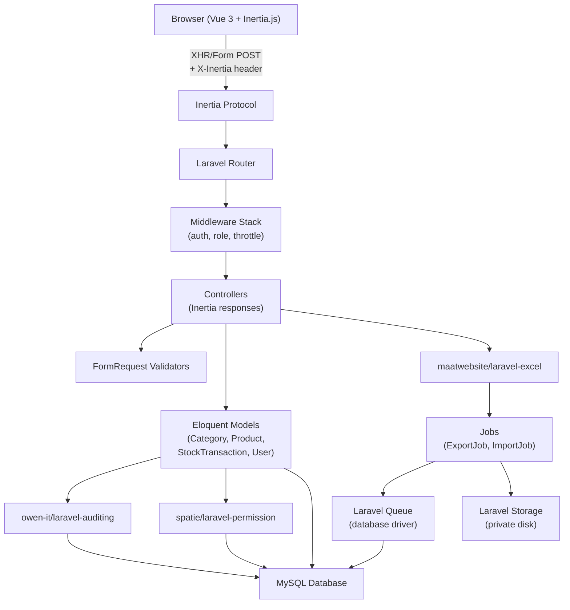
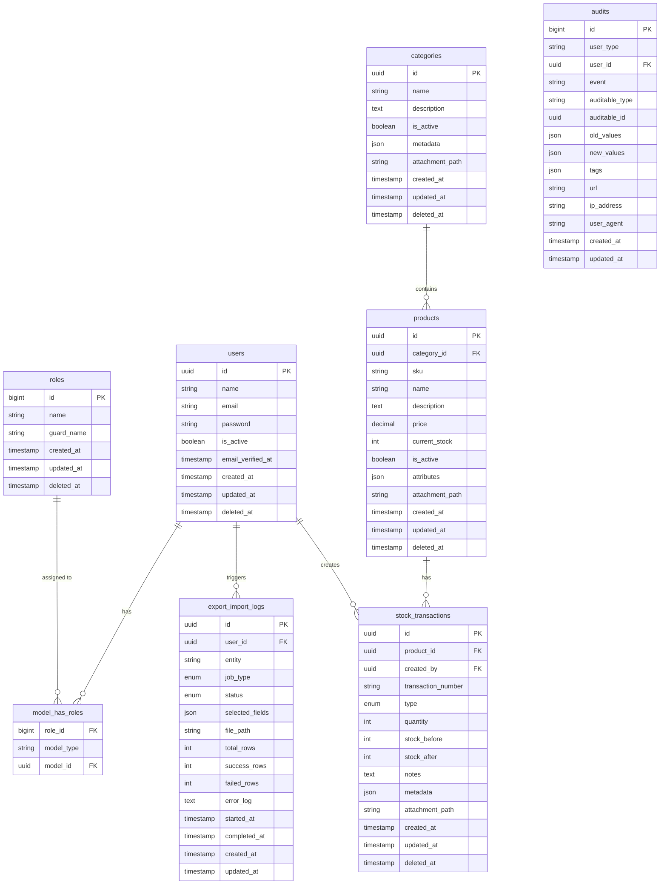

# Design Document: Inventori App

## Overview

Inventori App adalah aplikasi manajemen inventori berbasis web full-stack yang dibangun di atas Laravel 11 (backend/API layer) + Vue.js 3 + Inertia.js (SPA-like frontend) + Bootstrap 5 (UI framework). Aplikasi menggunakan arsitektur monolith dengan Inertia.js sebagai jembatan antara Laravel controller dan Vue component, sehingga tidak memerlukan REST API terpisah untuk navigasi SPA.

Fitur utama mencakup: autentikasi berbasis session, CRUD tiga entitas utama (Category, Product, StockTransaction) yang saling berelasi, role-based access control via Spatie Permission, audit trail via owen-it/laravel-auditing, soft-deletes, upload file PDF, autocomplete berbasis database, searching/filtering/sorting, dan export/import Excel berbasis Laravel Queue.

## Architecture



### Technology Stack

| Layer | Technology | Version |
|---|---|---|
| Backend Framework | Laravel | 11.x |
| PHP | PHP | 8.2+ |
| Frontend Framework | Vue.js | 3.x (Composition API) |
| SPA Bridge | Inertia.js | 1.x |
| CSS Framework | Bootstrap | 5.3 |
| Database | MySQL | 8.0+ |
| ORM | Eloquent | (bundled Laravel) |
| Auth | Laravel Breeze + Inertia | - |
| Role & Permission | spatie/laravel-permission | 6.x |
| Audit Trail | owen-it/laravel-auditing | 13.x |
| Excel Export/Import | maatwebsite/laravel-excel | 3.x |
| Queue Driver | Laravel Queue (database) | - |
| Autocomplete | Tom Select | 2.x |
| UUID | Laravel UUID (Str::uuid) | native |
| HTTP Client (Vue) | Inertia router + axios | - |

---

## Components and Interfaces

### Laravel Controller Structure

```
app/Http/Controllers/
├── Auth/
│   └── AuthenticatedSessionController.php
├── CategoryController.php
├── ProductController.php
├── StockTransactionController.php
├── RoleController.php
├── UserController.php
├── ExportImportLogController.php
└── Api/
    ├── CategorySearchController.php
    ├── ProductSearchController.php
    └── RoleSearchController.php
```

### FormRequest Validators

```
app/Http/Requests/
├── Auth/LoginRequest.php
├── StoreCategoryRequest.php
├── UpdateCategoryRequest.php
├── StoreProductRequest.php
├── UpdateProductRequest.php
├── StoreStockTransactionRequest.php
├── UpdateStockTransactionRequest.php
├── StoreRoleRequest.php
├── UpdateRoleRequest.php
├── StoreUserRequest.php
└── UpdateUserRequest.php
```

### Eloquent Models

```
app/Models/
├── User.php           (HasRoles, Auditable, SoftDeletes)
├── Category.php       (Auditable, SoftDeletes, HasMany: Product, Attachment)
├── Product.php        (Auditable, SoftDeletes, BelongsTo: Category, HasMany: StockTransaction, Attachment)
├── StockTransaction.php (Auditable, SoftDeletes, BelongsTo: Product & User)
├── Role.php           (extends Spatie\Role, Auditable)
└── ExportImportLog.php
```

### Vue Component Structure

```
resources/js/
├── app.js                          # Inertia bootstrap
├── Pages/
│   ├── Landing.vue                 # Public landing page
│   ├── Auth/
│   │   └── Login.vue
│   ├── Dashboard.vue
│   ├── Categories/
│   │   ├── Index.vue               # List + search/filter/sort/export/import
│   │   ├── Create.vue
│   │   ├── Edit.vue
│   │   └── Show.vue                # Detail + audit trail
│   ├── Products/
│   │   ├── Index.vue
│   │   ├── Create.vue
│   │   ├── Edit.vue
│   │   └── Show.vue
│   ├── StockTransactions/
│   │   ├── Index.vue
│   │   ├── Create.vue
│   │   ├── Edit.vue
│   │   └── Show.vue
│   ├── Roles/
│   │   ├── Index.vue
│   │   ├── Create.vue
│   │   ├── Edit.vue
│   │   └── Show.vue
│   ├── Users/
│   │   ├── Index.vue
│   │   ├── Create.vue
│   │   ├── Edit.vue
│   │   └── Show.vue
│   └── ExportImportLogs/
│       └── Index.vue
├── Components/
│   ├── Layout/
│   │   ├── AppLayout.vue           # Auth layout dengan sidebar + navbar
│   │   └── GuestLayout.vue         # Public layout
│   ├── Shared/
│   │   ├── DataTable.vue           # Reusable table dengan sort header
│   │   ├── SearchFilter.vue        # Search + filter bar
│   │   ├── Pagination.vue
│   │   ├── FlashMessage.vue        # Success/error notification
│   │   ├── AuditTrail.vue          # Reusable audit trail component
│   │   ├── ConfirmModal.vue        # Delete confirmation
│   │   ├── ExportModal.vue         # Dynamic field export
│   │   ├── ImportModal.vue         # Dynamic field import + column mapping
│   │   ├── FileUpload.vue          # PDF upload dengan validasi
│   │   └── TomSelectInput.vue      # Wrapper untuk Tom Select
│   └── Icons/
│       └── (SVG icon components)
```

### Jobs & Exports/Imports

```
app/
├── Jobs/
│   ├── ExportJob.php              # Generic export dispatcher
│   └── ImportJob.php              # Generic import dispatcher
├── Exports/
│   ├── CategoryExport.php
│   ├── ProductExport.php
│   ├── StockTransactionExport.php
│   ├── RoleExport.php
│   └── UserExport.php
└── Imports/
    ├── CategoryImport.php
    ├── ProductImport.php
    ├── StockTransactionImport.php
    ├── RoleImport.php
    └── UserImport.php
```

### Route Map

```
# Public routes
GET  /                              → LandingController
GET  /login                         → Auth\AuthenticatedSessionController@create
POST /login                         → Auth\AuthenticatedSessionController@store
POST /logout                        → Auth\AuthenticatedSessionController@destroy

# Auth routes (middleware: auth)
GET  /dashboard                     → DashboardController@index

# Role management (middleware: auth)
GET  /roles                         → RoleController@index
GET  /roles/create                  → RoleController@create
POST /roles                         → RoleController@store
GET  /roles/{role}                  → RoleController@show
GET  /roles/{role}/edit             → RoleController@edit
PUT  /roles/{role}                  → RoleController@update
DELETE /roles/{role}                → RoleController@destroy

# User management (middleware: auth, role:Administrator)
GET  /users                         → UserController@index
GET  /users/create                  → UserController@create
POST /users                         → UserController@store
GET  /users/{user}                  → UserController@show
GET  /users/{user}/edit             → UserController@edit
PUT  /users/{user}                  → UserController@update
DELETE /users/{user}                → UserController@destroy

# Category management (middleware: auth)
GET  /categories                    → CategoryController@index
GET  /categories/create             → CategoryController@create
POST /categories                    → CategoryController@store
GET  /categories/{category}         → CategoryController@show
GET  /categories/{category}/edit    → CategoryController@edit
PUT  /categories/{category}         → CategoryController@update
DELETE /categories/{category}       → CategoryController@destroy

# Product management (middleware: auth)
GET  /products                      → ProductController@index
GET  /products/create               → ProductController@create
POST /products                      → ProductController@store
GET  /products/{product}            → ProductController@show
GET  /products/{product}/edit       → ProductController@edit
PUT  /products/{product}            → ProductController@update
DELETE /products/{product}          → ProductController@destroy

# Stock Transaction management (middleware: auth)
GET  /stock-transactions            → StockTransactionController@index
GET  /stock-transactions/create     → StockTransactionController@create
POST /stock-transactions            → StockTransactionController@store
GET  /stock-transactions/{txn}      → StockTransactionController@show
GET  /stock-transactions/{txn}/edit → StockTransactionController@edit
PUT  /stock-transactions/{txn}      → StockTransactionController@update
DELETE /stock-transactions/{txn}    → StockTransactionController@destroy

# Export/Import (middleware: auth)
POST /export/{entity}               → ExportController@dispatch
POST /import/{entity}               → ImportController@dispatch
GET  /import/{entity}/preview       → ImportController@preview
GET  /export-import-logs            → ExportImportLogController@index
GET  /exports/{log}/download        → ExportController@download

# API routes (middleware: auth) — for autocomplete
GET  /api/categories/search         → Api\CategorySearchController
GET  /api/products/search           → Api\ProductSearchController
GET  /api/roles/search              → Api\RoleSearchController
GET  /api/import/{log}/preview      → Api\ImportPreviewController

# File download (middleware: auth)
GET  /attachments/{entity}/{id}     → AttachmentController@download
```

---

## Data Models

### Entity Relationship Diagram



### Database Schema Detail

#### Table: `users`
```sql
CREATE TABLE users (
    id            CHAR(36) PRIMARY KEY,  -- UUID v4
    name          VARCHAR(255) NOT NULL,
    email         VARCHAR(255) UNIQUE NOT NULL,
    password      VARCHAR(255) NOT NULL,
    is_active     TINYINT(1) NOT NULL DEFAULT 1,
    email_verified_at TIMESTAMP NULL,
    remember_token VARCHAR(100) NULL,
    created_at    TIMESTAMP NULL,
    updated_at    TIMESTAMP NULL,
    deleted_at    TIMESTAMP NULL,
    INDEX idx_users_email (email),
    INDEX idx_users_deleted (deleted_at)
);
```

#### Table: `categories`
```sql
CREATE TABLE categories (
    id              CHAR(36) PRIMARY KEY,
    name            VARCHAR(255) NOT NULL,
    description     TEXT NULL,
    is_active       TINYINT(1) NOT NULL DEFAULT 1,
    metadata        JSON NULL,
    attachment_path VARCHAR(500) NULL,
    created_at      TIMESTAMP NULL,
    updated_at      TIMESTAMP NULL,
    deleted_at      TIMESTAMP NULL,
    INDEX idx_categories_name (name),
    INDEX idx_categories_active (is_active),
    INDEX idx_categories_deleted (deleted_at)
);
```

#### Table: `products`
```sql
CREATE TABLE products (
    id              CHAR(36) PRIMARY KEY,
    category_id     CHAR(36) NOT NULL,
    sku             VARCHAR(100) UNIQUE NOT NULL,
    name            VARCHAR(255) NOT NULL,
    description     TEXT NULL,
    price           DECIMAL(15,2) NOT NULL DEFAULT 0,
    current_stock   INT NOT NULL DEFAULT 0,
    is_active       TINYINT(1) NOT NULL DEFAULT 1,
    attributes      JSON NULL,
    attachment_path VARCHAR(500) NULL,
    created_at      TIMESTAMP NULL,
    updated_at      TIMESTAMP NULL,
    deleted_at      TIMESTAMP NULL,
    FOREIGN KEY (category_id) REFERENCES categories(id),
    INDEX idx_products_category (category_id),
    INDEX idx_products_sku (sku),
    INDEX idx_products_name (name),
    INDEX idx_products_active (is_active),
    INDEX idx_products_deleted (deleted_at)
);
```

#### Table: `stock_transactions`
```sql
CREATE TABLE stock_transactions (
    id                  CHAR(36) PRIMARY KEY,
    product_id          CHAR(36) NOT NULL,
    created_by          CHAR(36) NOT NULL,
    transaction_number  VARCHAR(50) UNIQUE NOT NULL,
    type                ENUM('in','out') NOT NULL,
    quantity            INT NOT NULL,
    stock_before        INT NOT NULL,
    stock_after         INT NOT NULL,
    notes               TEXT NULL,
    metadata            JSON NULL,
    attachment_path     VARCHAR(500) NULL,
    created_at          TIMESTAMP NULL,
    updated_at          TIMESTAMP NULL,
    deleted_at          TIMESTAMP NULL,
    FOREIGN KEY (product_id) REFERENCES products(id),
    FOREIGN KEY (created_by) REFERENCES users(id),
    INDEX idx_txn_product (product_id),
    INDEX idx_txn_type (type),
    INDEX idx_txn_number (transaction_number),
    INDEX idx_txn_created_at (created_at),
    INDEX idx_txn_deleted (deleted_at)
);
```

#### Table: `export_import_logs`
```sql
CREATE TABLE export_import_logs (
    id              CHAR(36) PRIMARY KEY,
    user_id         CHAR(36) NOT NULL,
    entity          VARCHAR(100) NOT NULL,  -- 'categories','products','stock_transactions','users','roles'
    job_type        ENUM('export','import') NOT NULL,
    status          ENUM('pending','processing','completed','failed') NOT NULL DEFAULT 'pending',
    selected_fields JSON NULL,
    file_path       VARCHAR(500) NULL,
    total_rows      INT NULL,
    success_rows    INT NULL,
    failed_rows     INT NULL,
    error_log       TEXT NULL,
    started_at      TIMESTAMP NULL,
    completed_at    TIMESTAMP NULL,
    created_at      TIMESTAMP NULL,
    updated_at      TIMESTAMP NULL,
    FOREIGN KEY (user_id) REFERENCES users(id),
    INDEX idx_eil_user (user_id),
    INDEX idx_eil_status (status),
    INDEX idx_eil_entity (entity)
);
```

### Key Model Behaviors

#### UUID Primary Key (All Models)
```php
// Trait: app/Traits/HasUuid.php
public static function boot(): void {
    parent::boot();
    static::creating(fn($model) => $model->id = (string) Str::uuid());
}
protected $keyType = 'string';
public $incrementing = false;
```

#### Auditable Fields Exclusion (StockTransaction)
```php
// app/Models/StockTransaction.php
protected array $auditExclude = ['notes', 'attachment_path', 'updated_at'];
// Fields stock_before, stock_after, quantity, type, product_id are READ-ONLY after creation
// Enforced via UpdateStockTransactionRequest: only allow notes & attachment updates
```

#### StockTransaction Auto-number Generation
```php
// Format: TXN-YYYYMMDD-NNNN (e.g., TXN-20241215-0001)
// Generated in StockTransactionController@store before saving
```

#### Category → Product Relationship
```php
// Category.php
public function products(): HasMany {
    return $this->hasMany(Product::class);
}
// Product.php
public function category(): BelongsTo {
    return $this->belongsTo(Category::class);
}
```

#### Product → StockTransaction Relationship
```php
// Product.php
public function stockTransactions(): HasMany {
    return $this->hasMany(StockTransaction::class);
}
// StockTransaction.php
public function product(): BelongsTo {
    return $this->belongsTo(Product::class)->withTrashed();
}
public function createdBy(): BelongsTo {
    return $this->belongsTo(User::class, 'created_by');
}
```

### Spatie Permission Seeder
```
Roles (seeded): Administrator, Staff
Default users:
  - admin@inventori.test → password: password → role: Administrator
  - staff@inventori.test → password: password → role: Staff
```

---

## Correctness Properties

*A property adalah karakteristik atau perilaku yang harus berlaku di seluruh eksekusi sistem yang valid — pada dasarnya, pernyataan formal tentang apa yang harus dilakukan sistem. Properties berfungsi sebagai jembatan antara spesifikasi yang dapat dibaca manusia dan jaminan kebenaran yang dapat diverifikasi mesin.*

### Property 1: File Upload Validation Enforces Size Range

*For any* file yang diupload ke endpoint attachment, jika ukuran file di luar rentang [100KB, 500KB] atau bukan bertipe PDF, maka sistem harus menolak upload dan tidak menyimpan file ke storage maupun memperbarui field `attachment_path`.

**Validates: Requirements 10.2, 10.3, 10.4, 10.5, 10.6**

### Property 2: Stock Transaction Immutability of Core Fields

*For any* StockTransaction yang sudah tersimpan di database, percobaan update pada field `stock_before`, `stock_after`, `quantity`, `type`, atau `product_id` melalui endpoint apapun harus ditolak, dan nilai field tersebut harus tetap sama seperti saat pertama kali dibuat.

**Validates: Requirements 8.7, 9.5**

### Property 3: Stock Level Consistency After Transaction

*For any* StockTransaction yang berhasil dibuat, nilai `current_stock` pada produk terkait harus sama dengan nilai `stock_after` pada transaksi tersebut, dan `stock_after = stock_before + quantity` (untuk tipe `in`) atau `stock_after = stock_before - quantity` (untuk tipe `out`).

**Validates: Requirements 8.4, 8.5, 8.6**

### Property 4: Autocomplete Returns Only Active Records

*For any* query ke endpoint autocomplete (`/api/categories/search`, `/api/products/search`), semua item yang dikembalikan harus memiliki `is_active = true` dan tidak memiliki `deleted_at` yang terisi.

**Validates: Requirements 11.2, 11.3, 11.4**

### Property 5: Search/Filter State Preserved in URL

*For any* kombinasi parameter search, filter, dan sort yang valid, state tersebut harus dapat direpresentasikan dalam URL query string sehingga reload halaman atau akses ulang URL tersebut menghasilkan tampilan data yang identik.

**Validates: Requirements 12.5**

### Property 6: Export Field Selection Produces Correct Columns

*For any* subset kolom yang dipilih pada saat export, file Excel yang dihasilkan harus mengandung tepat kolom-kolom yang dipilih tersebut — tidak lebih, tidak kurang.

**Validates: Requirements 13.2, 13.4**

### Property 7: Soft Delete Preserves Data Integrity

*For any* entitas yang di-soft-delete, data tersebut tidak boleh muncul dalam daftar default, tapi harus masih ada di database (field `deleted_at` terisi), dan semua relasi yang referencing entitas tersebut harus tetap dapat di-retrieve menggunakan `withTrashed()`.

**Validates: Requirements 16.3**

### Property 8: Audit Record Created for Every Mutation

*For any* operasi create, update, atau delete pada entitas Category, Product, StockTransaction, User, atau Role, harus terdapat minimal satu record baru di tabel `audits` yang memiliki `auditable_type` dan `auditable_id` yang sesuai dengan entitas yang dimutasi.

**Validates: Requirements 9.1, 9.2**

---

## Error Handling

### Validation Errors
- Laravel FormRequest melempar `ValidationException` → Inertia mengirim balik errors ke Vue component
- Vue component menampilkan error message di bawah setiap field yang gagal validasi
- Flash message ditampilkan untuk operasi yang berhasil/gagal di level halaman

### Authorization Errors
- Middleware `role:Administrator` pada route `/users` melempar `AuthorizationException` → ditangkap oleh custom exception handler → render Inertia page 403
- Gate checks di controller melempar 403 jika user tidak punya permission

### File Upload Errors
- Validasi dilakukan di `StoreXxxRequest` menggunakan rules: `mimes:pdf`, `min:102` (KB), `max:512` (KB)
- Error dikembalikan via standard Inertia validation error response

### Queue Job Failures
- Job gagal diretry maksimal 3 kali dengan exponential backoff
- Setelah semua retry gagal: `failed_jobs` table diisi, `export_import_logs.status` diupdate ke `failed`, pesan error disimpan di `error_log`
- `ExportJob` dan `ImportJob` implement `ShouldQueue` + `Dispatchable`

### Stock Transaction Errors
- Validasi negative stock dilakukan di `StoreStockTransactionRequest` dengan custom rule: `stock >= 0 after transaction`
- Operasi update stok produk dan simpan transaksi dibungkus dalam `DB::transaction()`

### 404 / 500
- Custom error pages via Inertia: `Pages/Error.vue` dengan prop `status` (403, 404, 500)
- Handler di `bootstrap/app.php` atau `app/Exceptions/Handler.php`

---

## Testing Strategy

### PBT Applicability Assessment

Aplikasi ini adalah web application dengan banyak komponen berbasis UI (Inertia/Vue), operasi CRUD, database, dan queue. PBT paling tepat diterapkan pada layer **business logic murni** (pure functions dan validasi), bukan pada layer infrastructure, UI rendering, atau external services.

Fitur yang **cocok untuk PBT**:
- Validasi ukuran file (Requirement 10): input bervariasi, logic murni
- Kalkulasi stock transaction (Requirement 8): input bervariasi, logic matematika
- Filter/search query builder (Requirement 12): kombinasi parameter bervariasi

Fitur yang **tidak cocok untuk PBT** (gunakan example-based / integration tests):
- Inertia page rendering (UI)
- Queue job dispatching (external)
- Excel export/import (external library)
- Audit trail via owen-it package (external)

### Unit Tests (PHPUnit + Pest)

```
tests/Unit/
├── FileUploadValidationTest.php    # Property 1: ukuran & mime validation
├── StockCalculationTest.php        # Property 3: stock_before/after/quantity
├── TransactionImmutabilityTest.php # Property 2: immutable fields
└── AuditCreationTest.php           # Property 8: audit on every mutation
```

### Feature / Integration Tests (Pest)

```
tests/Feature/
├── Auth/
│   └── AuthenticationTest.php
├── Categories/
│   ├── CategoryCrudTest.php
│   ├── CategorySearchFilterSortTest.php  # Property 5
│   └── CategoryExportImportTest.php
├── Products/
│   ├── ProductCrudTest.php
│   └── ProductAutocompleteTest.php       # Property 4
├── StockTransactions/
│   ├── StockTransactionCrudTest.php
│   └── StockTransactionImmutabilityTest.php
├── Roles/
│   └── RoleCrudTest.php
├── Users/
│   └── UserCrudAuthorizationTest.php
└── ExportImport/
    ├── ExportDynamicFieldsTest.php       # Property 6
    └── ImportColumnMappingTest.php
```

### Property-Based Tests (Pest + `giorgiosav/pest-plugin-randomize` atau custom generator)

Karena ekosistem utama adalah PHP/Laravel, PBT diimplementasikan menggunakan PHPUnit data providers dengan generated datasets:

```php
// Property 1: File Upload Size Range
it('rejects files outside 100-500 KB range', function (int $sizeKB) {
    $file = UploadedFile::fake()->create('test.pdf', $sizeKB);
    // ... assert validation fails
})->with(fn() => array_merge(
    range(1, 99),    // too small
    range(501, 600)  // too large
));

// Property 3: Stock Consistency
it('stock_after equals stock_before +/- quantity for any valid transaction', function (int $initial, int $qty, string $type) {
    // ... create product with $initial stock, create transaction
    // ... assert product->current_stock == stock_after
    // ... assert stock_after == ($type === 'in' ? $initial + $qty : $initial - $qty)
})->with(generateStockCombinations());
```

### PBT Test Tags

Setiap property test diannotasikan:
- `Feature: inventori-app, Property N: <property_text>`

### Testing Coverage Goals

| Layer | Target Coverage |
|---|---|
| Models (business logic) | 90%+ |
| Controllers (HTTP) | 80%+ |
| Jobs (queue logic) | 80%+ |
| FormRequests (validation) | 95%+ |
| Vue Components | snapshot + example tests |
